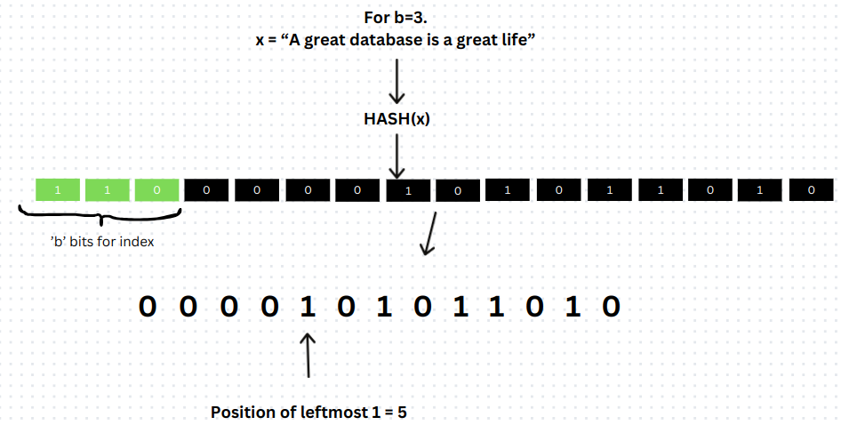
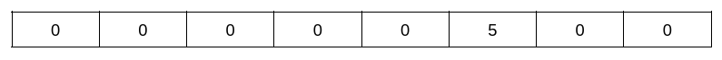
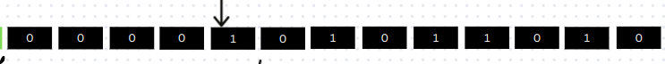
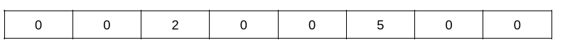
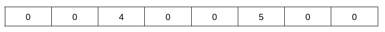
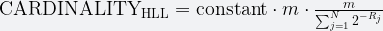

> 早在去年的年底就写完了CMU15-445的project0，但是当时写完有几十个Bug，陆陆续续改了一两天之后去忙别的事情了，就一直没有写完，github上找到了之前提交的新分支，准备重头看下题目然后继续快速的通过这个project0，个人认为这个Project0出得还是很有新意，和之前的什么字典树，前缀树之类的数据结构有较大区别，这是一个Probablistic data structure 一种概率数据结构。

## Project Specification

### [项目官网](https://15445.courses.cs.cmu.edu/fall2024/project0/)

### 基础介绍

目的：Keeping track of the number of unique users accessing a website in a single day .

当对少数人访问的网站直接记录就好了，但是对有数十亿的用户来说要去重就非常的麻烦，所以就产生了HyperLogLog(HLL)这个概率数据结构，以极小的误差计算海量数据流种的唯一项目的数量，不显式存储唯一项目。

关键变量：

- b : 哈希值二进制表示形式中的初始位数

- m ：设定的桶数，`m=2^b`
- p ：剩余的哈希位中最左端第一个1的位置

具体样例解释：

>Consider a simple example of how this algorithm works using the string `"A great database is a great life"`. First, the string is hashed to produce a hash value, which is then converted into its binary representation. From the hash value (binary form), `b` bits are extracted, starting from the most significant bit(MSB). The register value is calculated from the extracted bits. (by default each register has a value of `0`).
>考虑一个使用字符串 `"A great database is a great life"` .首先，对字符串进行哈希处理以生成哈希值，然后将其转换为其二进制表示形式。从哈希值（二进制形式）中提取 `b` 位，从最高有效位 （MSB） 开始。寄存器值是根据提取的 bits 计算得出的。（默认情况下，每个 register 的值为 `0`）。
>
>From the remaining set of bits, the position of the leftmost 1 is obtained (MSB), i.e the number of leading zeros from left plus 1 (as given in the picture given below).
>从剩余的一组位中，获得最左边的 1 的位置 （MSB），即从左边开始的前导零加 1 的数量（如下图所示）。
>
>
>
>After this, using the `b` bits, the register value is calculated (which in the above case it’s 6). Hence, in register 6, `max(register[6], p)` will be stored.
>在此之后，使用 `b` 位计算 register 值（在上述情况下为 6）。因此，在寄存器 6 中，`将存储 max（register[6]， p）。`
>
>
>

**然后会去掉前b个bits位然后再重头取，依次往复**

> 
>
> Another value in a set may have p = 2 in register 3, hence 2 will be stored in register 3.
> 一组中的另一个值可能在寄存器 3 中具有 p = 2，因此 2 将存储在寄存器 3 中。
>
> 
>
> 后续便不再配图~
>
> Now, another element in a set has p = 2 in register 6. Hence, `max(register[6], p) –> max(5, 2)` will be stored in register 6.
> 现在，集合中的另一个元素在寄存器 6 中具有 p = 2。因此， `max(register[6], p) –> max(5, 2)` 将存储在寄存器 6 中。
>
> 
>
> Similarly, another element having p = 4 in register 3, `max(register[3], p) –> max (2, 4)` will be stored in register 3.
> 同样，寄存器 3 中 p = 4 的另一个元素 `max(register[3], p) –> max (2, 4)` 将存储在寄存器 3 中。
>
> 
>
> After all the elements in the set have been added, cardinality is calculated in the following manner.
> 添加集合中的所有元素后，按以下方式计算基数。
>
> If there are total of `m`（既2^b） registers, then:
> 如果总共有 `m` 个 registers，则：
>
> 
>
> where `constant = 0.79402` and `R[j]` is the value in register `j` and `N = m`.
> 其中 `constant = 0.79402` 和 `R[j]` 是寄存器 `j` 和 `N = m` 中的值。
>
> Another value in a set may have p = 2 in register 3, hence 2 will be stored in register 3.
> 一组中的另一个值可能在寄存器 3 中具有 p = 2，因此 2 将存储在寄存器 3 中。
>
> 
>
> Now, another element in a set has p = 2 in register 6. Hence, `max(register[6], p) –> max(5, 2)` will be stored in register 6.
> 现在，集合中的另一个元素在寄存器 6 中具有 p = 2。因此， `max(register[6], p) –> max(5, 2)` 将存储在寄存器 6 中。
>
> 
>
> Similarly, another element having p = 4 in register 3, `max(register[3], p) –> max (2, 4)` will be stored in register 3.
> 同样，寄存器 3 中 p = 4 的另一个元素 `max(register[3], p) –> max (2, 4)` 将存储在寄存器 3 中。
>
> 
>
> After all the elements in the set have been added, cardinality is calculated in the following manner.
> 添加集合中的所有元素后，按以下方式计算基数。
>
> If there are total of `m` 即($2^b$)registers, then:
> 如果总共有 `m` 个 registers，则：
>
> 
>
> where `constant = 0.79402` and `R[j]` is the value in register `j` and `N = m`.
> 其中 `constant = 0.79402` 和 `R[j]` 是寄存器 `j` 和 `N = m` 中的值。
>
> 
>
> 

文章中解释的很清楚，这里就不多赘述了，只明确几个点：(其实我看了半年才看懂，xs。)

- 一共的桶数为m，根据b个二进制数一共能得到$2^b$个组合得出的m，所以在概率上所有桶是等概率的获得数字、
- 这个概率型数据结构的证明不属于本篇博文的讨论范围，故略过，教程中有Resources介绍其证明及实现HLL的博客。

### Note

**`Task1`将用最左边的1的位置作为p，`Task2`将使用最右边的连续零的个数作为p存储在寄存器中。** 

## Instructions 

### Task1:实现基本的HLL数据结构

>In `hyperloglog.h`, following functions have to be implemented:
>在 `hyperloglog.h` 中，必须实现以下功能：
>
>- `HyperLogLog(inital_bits)`: a constructor where a number of leading bits (b) is provided.
>  `HyperLogLog（inital_bits）：`一个构造函数，其中提供了多个前导位 （b）。
>- `GetCardinality()`: returns the cardinality value of a given set
>  `GetCardinality（）：`返回给定集的基数值
>- `AddElem(val)`: computes and places the value in the register.
>  `AddElem（val）：`计算值并将其放入寄存器中。
>- `ComputeCardinality()`: computes the cardinality based on the above formula.
>  `ComputeCardinality（）：`根据上述公式计算基数。
>
>Along with it, you can implement helper functions to implement the above (can add more as per requirement):
>除此之外，您还可以实现辅助函数来实现上述内容（可以根据要求添加更多）：
>
>- `ComputeBinary(hash_t hash)`: It computes a binary of a given hash value. The hash value should be converted to a 64 bit binary stream (otherwise tests may fail).
>  `ComputeBinary（hash_t hash）：`计算给定哈希值的二进制文件。哈希值应转换为 64 位二进制流（否则测试可能会失败）。
>- `PositionOfLeftmostOne(....)`: it computes the position of the leftmost 1.
>  `PositionOfLeftmostOne（....）`：它计算最左边的 1 的位置。
>
>For calculating hash, you can use the given function:
>要计算哈希值，您可以使用给定的函数：
>
>- `CalculateHash(...)` - to calculate hash
>  `CalculateHash（...）`- 计算哈希
>
>Please refer to the `std::bitset` library for storing in binary representation. When a value is obtained in decimal, convert into a greatest integer **less than or equal to** the decmial. Refer `std::floor` for more details.
>请参考 `std：：bitset` 库以二进制表示形式存储。当获得以十进制为单位的值时，转换为**小于或等于**十进制的最大整数。有关更多详细信息，请参阅 `std：：floor`

可以简单的发现，这几个函数的最终作用就是读取字符串，转换哈希串，转化成二进制字符串，按位处理，存入vector，所以可以轻易的写出代码：

在这里只展示`hyperLogLog.cpp`（但这个是最初版本，是错的）

#### 基本代码

```cpp
#include "primer/hyperloglog.h"

namespace bustub {

/** @brief Parameterized constructor. */
template <typename KeyType>
HyperLogLog<KeyType>::HyperLogLog(int16_t n_bits) : cardinality_(0) {
  if (n_bits < 1 || n_bits > 64) {
    throw std::invalid_argument("n_bits must be between 1 and 64");
  }
  this->n_bits = n_bits;
 //   BITSET_CAPACITY = n_bits;//应该是不能改这个的
  
  this->registers_=std::vector<uint64_t>(1<<n_bits,0);
  bitset_=std::bitset<BITSET_CAPACITY>(0);
}

/**
 * @brief Function that computes binary.
 *
 * @param[in] hash
 * @returns binary of a given hash
 */
template <typename KeyType>
auto HyperLogLog<KeyType>::ComputeBinary(const hash_t &hash) const -> std::bitset<BITSET_CAPACITY> {
  /** @TODO(student) Implement this function! */
 return  std::bitset<BITSET_CAPACITY>(hash);
 
}

/**
 * @brief Function that computes leading zeros.
 *
 * @param[in] bset - binary values of a given bitset
 * @returns leading zeros of given binary set
 */
template <typename KeyType>
auto HyperLogLog<KeyType>::PositionOfLeftmostOne(const std::bitset<BITSET_CAPACITY> &bset) const -> uint64_t {
  /** @TODO(student) Implement this function! */
  for (uint64_t i = static_cast<uint64_t>(BITSET_CAPACITY-(uint16_t)n_bits-1); i >1; i--) {//bset.test是从最右边开始遍历
    if (bset.test(i)) {
      return (BITSET_CAPACITY-(uint16_t)n_bits) - i;
    }
  }
  return 0; 
}

/**
 * @brief Adds a value into the HyperLogLog.
 *
 * @param[in] val - value that's added into hyperloglog
 */
template <typename KeyType>
auto HyperLogLog<KeyType>::AddElem(KeyType val) -> void {
  /*
  数出前面几个b然后把他变成寄存器的位置，然后数出1的位置然后塞进去
  */
 bitset_=std::bitset<BITSET_CAPACITY>(0);
 bitset_=ComputeBinary(CalculateHash(val));
 uint64_t decimal_value=0;
 for(uint64_t i=0;i<n_bits;i++){//计算桶的序号数
   uint64_t bit_index =BITSET_CAPACITY-n_bits+i;
   if(bitset_.test(bit_index)){
     decimal_value+=(1ull <<(i));//左移i位
   }
 }
 uint64_t positionlt_value = PositionOfLeftmostOne(bitset_);//计算除去桶左边第一个1的位置
  if(registers_[decimal_value]<positionlt_value){
    registers_[decimal_value]=positionlt_value;
  /** @TODO(student) Implement this function! */
  }
}

/**
 * @brief Function that computes cardinality.
 */
template <typename KeyType>
auto HyperLogLog<KeyType>::ComputeCardinality() -> void {
  for(int i=0;i<(1<<n_bits);i++){
  middle_pow_sum+=std::pow(2,-registers_[i]);
  }
  middle_pow_sum=(1.0*CONSTANT*(1<<n_bits)*(1<<n_bits))/middle_pow_sum;
  cardinality_=(uint64_t)floor(middle_pow_sum);//向下取整
  

  // /** @TODO(student) Implement this function! */
}

template class HyperLogLog<int64_t>;
template class HyperLogLog<std::string>;

}  // namespace bustub

```

#### 全面报错

发现一个测试点都没过，于是开始漫长的debug，因为不知道怎么debug高效，只能修改测试样例，看输出符不符合，现在还在尝试，可能之后用gdb来debug，虽然之前用过

#### 认真研究

~~接下来就是6月7日开始真正的对这个lab的研究~~

- 认真检验了代码，发现很多逻辑都是错的即在算index（即m）和算rank（即MSBS），遂对逻辑进行了修改，但还是一个测试没过

- 认真用gdb开始debug，发现中途输出`bitset`得到的是64个`1`，让我大为震惊，但是认真研究讨论过后发现在代码中用`cout`命令输出得到的`bitset`是正常的值，所以就姑且认为是编译器优化程序后的锅，把bitset这一段代码内联到后面，所以在前面就返回了一个默认的初始化的值。即这一段代码

  ```c++
  auto HyperLogLog<KeyType>::ComputeBinary(const hash_t &hash) const -> std::bitset<BITSET_CAPACITY> {
    //认为是优化的锅，在gdb调试中一直看不见bitset，显示全1
    /** @TODO(student) Implement this function! */
    std::bitset<BITSET_CAPACITY> bitset;
    bitset = std::bitset<BITSET_CAPACITY>(hash);
    // std::cout<<"bitset::"<<bitset;
    return bitset;
  }
  ```

- 以上都不是重点，发现不是上面的问题后就抛弃了`gdb`在代码中使用了大量的`cout`进行研究，发现了一个问题所在

  ```c++
    for (int i = 0; i < (1 << n_bits_); i++) {
      //  std::cout<<"registers_["<<i<<"]:"<<registers_[i]<<std::endl;
      //  std::cout<<middle_pow_sum<<std::endl;
      //   std::cout<< pow(2,0)<<std::endl;
      //    std::cout <<pow(2,-1)<<std::endl;
      middle_pow_sum += std::pow(2.0, -(registers_[i]));
      // std::cout<<middle_pow_sum+0.5<<std::endl;
    }
  ```

  在计算基数的代码中，发现当寄存器那一位是`-1`时就会使`middle_pow_sum`变为`0`！但是认真研究后不是`pow`函数的问题，最后终于定位问题所在---我在很久之前写代码的时候将`registers_`vector定为`vector<uint64_t>`导致其中发生了隐式转换，导致本来`middle_pow_sum`偏离本来的值。

- 在测试`EdgeTest1`发现总是会被`killed`+间歇性的电脑死机OOM。但是没有什么错误提示，认真研究后发现一个很蠢的即初始化一个`vector`为`vector(-2,0)`其会默认把`-2`转成一个接近`UINT_MAX`的数，开这么大的一个`vector`会导致函数超时会被`hyperloglog_test`直接杀死，修改后可通过。

故解决一堆报错后终于通过了`Task1`。

#### 参考代码

```c++
//===----------------------------------------------------------------------===//
//
//                         BusTub
//
// hyperloglog.cpp
//
// Identification: src/primer/hyperloglog.cpp
//
// Copyright (c) 2015-2025, Carnegie Mellon University Database Group
//
//===----------------------------------------------------------------------===//

#include "primer/hyperloglog.h"

namespace bustub {

/** @brief Parameterized constructor. */
template <typename KeyType>
HyperLogLog<KeyType>::HyperLogLog(int16_t n_bits_) : cardinality_(0) {
  if (n_bits_ < 1 || n_bits_ >= 64) {
    this->n_bits_ = 0;
  } else {
    this->n_bits_ = n_bits_;
  }
  //   BITSET_CAPACITY = n_bits_;//应该是不能改这个的
  this->registers_ = std::vector<int64_t>(1 << this->n_bits_, 0);  //在这个地方让vector赋值-2大小就导致一直爆oom，神奇！
  bitset_ = std::bitset<BITSET_CAPACITY>(0);
}

/**
 * @brief Function that computes binary.
 *
 * @param[in] hash
 * @returns binary of a given hash
 */
template <typename KeyType>
auto HyperLogLog<KeyType>::ComputeBinary(const hash_t &hash) const -> std::bitset<BITSET_CAPACITY> {
  //认为是优化的锅，在gdb调试中一直看不见bitset，显示全1
  /** @TODO(student) Implement this function! */
  std::bitset<BITSET_CAPACITY> bitset;
  bitset = std::bitset<BITSET_CAPACITY>(hash);
  // std::cout<<"bitset::"<<bitset;
  return bitset;
}

/**
 * @brief Function that computes leading zeros.
 *
 * @param[in] bset - binary values of a given bitset
 * @returns leading zeros of given binary set
 */
template <typename KeyType>
auto HyperLogLog<KeyType>::PositionOfLeftmostOne(const std::bitset<BITSET_CAPACITY> &bset) const -> uint64_t {
  /** @TODO(student) Implement this function! */
  uint64_t rank = 1;
  for (int i = BITSET_CAPACITY - n_bits_ - 1; i >= 0; i--) {
    if (bset.test(i)) {
      break;
    }
    rank++;
  }
  return rank;
}

/**
 * @brief Adds a value into the HyperLogLog.
 *
 * @param[in] val - value that's added into hyperloglog
 */
template <typename KeyType>
auto HyperLogLog<KeyType>::AddElem(KeyType val) -> void {
  /*
  数出前面几个b然后把他变成寄存器的位置，然后数出1的位置然后塞进去

  */

  hash_t hash = CalculateHash(val);
  std::bitset<BITSET_CAPACITY> bitset = ComputeBinary(hash);
  // std::cout<<"bitset:"<<bitset<<std::endl;
  uint64_t index = 0;
  for (int64_t i = 0; i < n_bits_; ++i) {
    uint64_t bit_index = BITSET_CAPACITY - 1 - i;
    if (bitset.test(bit_index)) {
      index |= (1ULL << (n_bits_ - 1 - i));
    }
  }

  std::bitset<BITSET_CAPACITY> suffix_bits(0);
  for (uint64_t i = 0; i < BITSET_CAPACITY - static_cast<uint64_t>(n_bits_); ++i) {
    suffix_bits[i] = bitset[i];
  }

  int64_t rank = PositionOfLeftmostOne(suffix_bits);
  if (registers_[index] < rank) {
    registers_[index] = rank;
  }
}

/**
 * @brief Function that computes cardinality.
 */
template <typename KeyType>
auto HyperLogLog<KeyType>::ComputeCardinality() -> void {
  double middle_pow_sum = 0;
  for (int i = 0; i < (1 << n_bits_); i++) {
    //  std::cout<<"registers_["<<i<<"]:"<<registers_[i]<<std::endl;
    //  std::cout<<middle_pow_sum<<std::endl;
    //   std::cout<< pow(2,0)<<std::endl;
    //    std::cout <<pow(2,-1)<<std::endl;
    middle_pow_sum += std::pow(2.0, -(registers_[i]));
    // std::cout<<middle_pow_sum+0.5<<std::endl;
  }
  if (middle_pow_sum == 0) {
    cardinality_ = 0;
    return;
  }
  middle_pow_sum = (1.0 * CONSTANT * (1 << n_bits_) * (1 << n_bits_)) / middle_pow_sum;
  cardinality_ = middle_pow_sum;
  // std::cout<<"middle_pow_sum:"<<middle_pow_sum<<std::endl;
  /** @TODO(student) Implement this function! */
}

template class HyperLogLog<int64_t>;
template class HyperLogLog<std::string>;

}  // namespace bustub

```

### Task2：使用桶存放数据

题目详情见官网。

#### 易错点

区别就是算`rank`时把从左往右数`前导0+1`换成了从右往左数`连续0`再把连续0的个数存在两个桶里，一个`Dense_bucket`,一个`Overflow_bucket`舍弃了寄存器这么一个概念，用以上两个来代替，为了考察一下位运算。

两个重要的点：

- 更新`rank`时，要用位运算先弄出旧的`rank`,如果可以更新就要同步更新`Dense_bucket`和`Overflow_bucket`不能分开来更新，不然会得到一个偏大的数。
- 在写`ComputeCardinality`这个函数时也要注意要把这两个桶里的值取出来然后算出`rank`值再进行计算，其他的就没什么难得了

#### 参考代码

**hyperloglog_presto.cpp**

```c++
//===----------------------------------------------------------------------===//
//
//                         BusTub
//
// hyperloglog_presto.cpp
//
// Identification: src/primer/hyperloglog_presto.cpp
//
// Copyright (c) 2015-2025, Carnegie Mellon University Database Group
//
//===----------------------------------------------------------------------===//

#include "primer/hyperloglog_presto.h"
#include <unordered_map>
#include "primer/hyperloglog.h"

namespace bustub {

/** @brief Parameterized constructor. */
template <typename KeyType>
HyperLogLogPresto<KeyType>::HyperLogLogPresto(int16_t n_leading_bits) : cardinality_(0) {
  if (n_leading_bits < 1 || n_leading_bits >= 64) {
    this->n_bits_ = 0;
  } else {
    this->n_bits_ = n_leading_bits;
  }
  //   BITSET_CAPACITY = n_bits_;//应该是不能改这个的
  this->registers_ = std::vector<int64_t>(1 << n_leading_bits, 0);
  bitset_ = std::bitset<BITSET_CAPACITY>(0);
  dense_bucket_ = std::vector<std::bitset<DENSE_BUCKET_SIZE>>(1 << n_bits_, std::bitset<DENSE_BUCKET_SIZE>(0));
  cardinality_ = 0;
}

/** @brief Element is added for HLL calculation. */
template <typename KeyType>
auto HyperLogLogPresto<KeyType>::AddElem(KeyType val) -> void {
  /** @TODO(student) Implement this function! */
  hash_t hash_value = CalculateHash(val);
  //  std::cout<<"val="<<val<<"  "<<"hash="<<hash_value<<std::endl;//hash =0
  std::bitset<BITSET_CAPACITY> bitset(hash_value);
  //  std::cout<<"bitset="<<bitset<<std::endl;
  uint64_t bset_index = 0;
  for (int i = 0; i < n_bits_; i++) {
    uint64_t index = BITSET_CAPACITY - i - 1;
    bset_index |= (static_cast<int>(bitset[index]) << (n_bits_ - i - 1));
  }  //算出了寄存器的索引
  // std::cout<<"bset_index="<<bset_index<<std::endl;
  //接下来算最后面的0的个数
  uint64_t rank = 0;
  for (int i = 0; i < BITSET_CAPACITY - n_bits_; i++) {
    if (static_cast<int>(bitset[i]) == 0) {
      rank++;
    } else {
      break;
    }
  }  //算出了rank的十进制

  //  std::cout<<"rank="<<rank<<std::endl;
  //感觉其实直接按位算会更好，先用位运算弄出下四位，即把高三位mask掉
  uint64_t dense_rank = rank & ((1 << DENSE_BUCKET_SIZE) - 1);
  uint64_t overflow_rank = rank >> DENSE_BUCKET_SIZE;
  //把他转成2进制
  std::bitset<DENSE_BUCKET_SIZE> new_dense_bitset(dense_rank);
  std::bitset<OVERFLOW_BUCKET_SIZE> new_overflow_bitset(overflow_rank);
  uint64_t old_dense_rank = dense_bucket_[bset_index].to_ullong();
  auto it = overflow_bucket_.find(bset_index);
  uint64_t new_overflow_rank = (it != overflow_bucket_.end()) ? it->second.to_ullong() : 0;
  uint64_t old_rank = old_dense_rank + (new_overflow_rank << DENSE_BUCKET_SIZE);
  if (rank > old_rank) {
    dense_bucket_[bset_index] = new_dense_bitset;
    overflow_bucket_[bset_index] = new_overflow_bitset;
  }
  //接下来按位拆分，高位放Dense
}

/** @brief Function to compute cardinality. */
template <typename T>
auto HyperLogLogPresto<T>::ComputeCardinality() -> void {
  double middle_pow_sum = 0;
  ;
  for (int i = 0; i < (1 << n_bits_); i++) {
    uint64_t rank = dense_bucket_[i].to_ullong();
    rank += overflow_bucket_[i].to_ullong() << DENSE_BUCKET_SIZE;
    middle_pow_sum += std::pow(2.0, -static_cast<int64_t>(rank));
    // std::cout<<dense_bucket_[0].to_ullong()<<" "<<overflow_bucket_[0].to_ullong()<<" "<<rank<<std::endl;
    // std::cout<<"fuck_rank="<<rank<<std::endl;
  }
  if (middle_pow_sum == 0) {
    cardinality_ = 0;
    return;
  }
  middle_pow_sum = (1.0 * CONSTANT * (1 << n_bits_) * (1 << n_bits_)) / middle_pow_sum;
  cardinality_ = middle_pow_sum;
  /** @TODO(student) Implement this function! */
}

template class HyperLogLogPresto<int64_t>;
template class HyperLogLogPresto<std::string>;
}  // namespace bustub

```

>终于做完了，发现阻碍我做的是cmake编译后的神秘优化+将uint64_t和int64_t混用，然后写错代码给Vecto(-2,0)，虽然还是很纳闷为什么会直接被杀死或OOM而不是报错创建的Vector过大.
>
>建议大家一定要配以下`Clangd`的环境不然的话在写代码的过程中缺少各种错误提示和代码补全还是蛮糟糕的。
